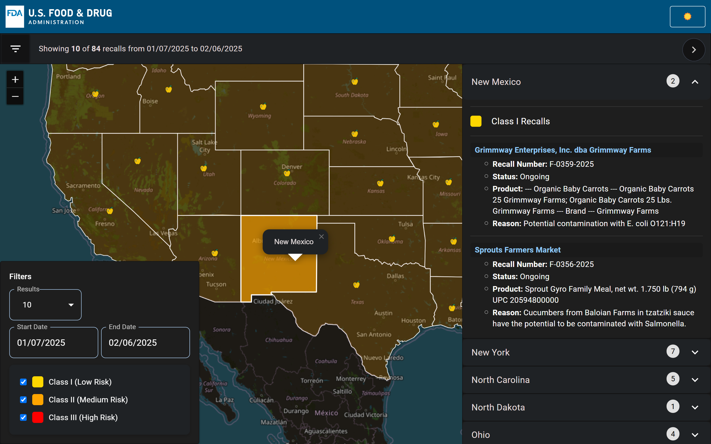
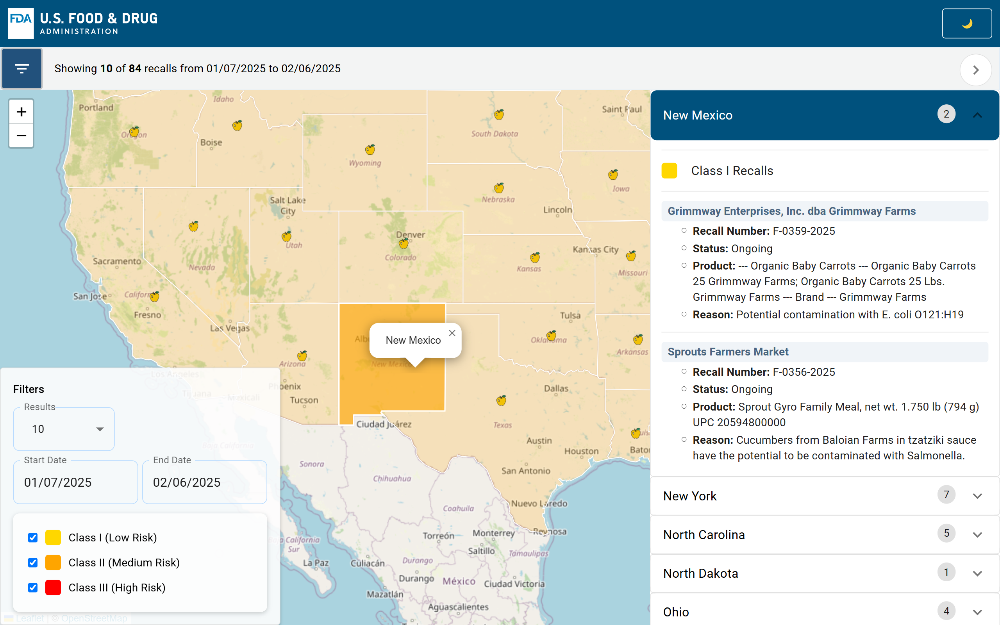

This application retrieves the published FDA recalls from the publicly available [openFDA food enforcement reports API](https://open.fda.gov/apis/food/enforcement/) and displays them on a map based on state and classification level. Recalls can be retrieved between user selected start and end dates.

---

---

Tech stack in use:

- React
- Node.js
- Express
- GraphQL
- Apollo Server Express
- Webpack
- Babel
- Material UI

---

Disclaimer:

This data should not be used as a method to collect data to issue alerts to the public, nor should it be used to track the lifecycle of a recall. FDA seeks publicity about a recall only when it believes the public needs to be alerted to a serious hazard.

Further, FDA does not update the status of a recall after the recall has been classified according to its level of hazard. As such, the status of a recall (open, completed, or terminated) will remain unchanged after published in the Enforcement Reports.
